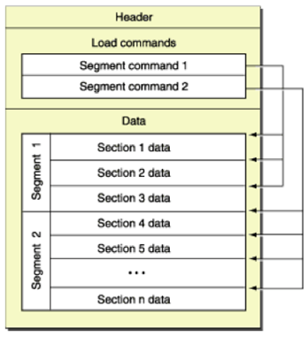

iOS/OS X维护了一个独有的二进制可执行文件格式：Mach-Object（简写Mach-O）,和UNIX的ELF的格式大同小异。其文件格式如下：



### Header

Mach header的主要作用就是帮助系统迅速的定位Mach-O文件的运行环境，文件类型。

```c
/*
 * The 64-bit mach header appears at the very beginning of object files for
 * 64-bit architectures.
 */
struct mach_header_64 {
	uint32_t	magic;		/* mach magic number identifier 魔数 32位-MH_MAGIC 64-MH_MAGIC_64 用于区分文件是32位还是64位*/
	cpu_type_t	cputype;	/* cpu specifier CPU平台 例如Intel ARM */
	cpu_subtype_t	cpusubtype;	/* machine specifier  版本 armv7s arm64*/
	uint32_t	filetype;	/* type of file 文件类型（可执行文件，库文件，Core，内和扩展...）*/
	uint32_t	ncmds;		/* number of load commands 加载命令的个数*/
	uint32_t	sizeofcmds;	/* the size of all the load commands 所有加载命令的大小*/
	uint32_t	flags;		/* flags dyld加载时需要的标志位*/
	uint32_t	reserved;	/* reserved 只有64位才有，保留字段*/
};

/* Constant for the magic field of the mach_header (32-bit architectures) */
#define	MH_MAGIC	0xfeedface	/* the mach magic number */
#define MH_CIGAM	0xcefaedfe	/* NXSwapInt(MH_MAGIC) */

/* Constant for the magic field of the mach_header_64 (64-bit architectures) */
#define MH_MAGIC_64 0xfeedfacf /* the 64-bit mach magic number */
#define MH_CIGAM_64 0xcffaedfe /* NXSwapInt(MH_MAGIC_64) */
```

查看二进制Mach header示例

```shell
# otool -v -h /usr/bin/git
Mach header
      magic cputype cpusubtype  caps    filetype ncmds sizeofcmds      flags
MH_MAGIC_64  X86_64        ALL LIB64     EXECUTE    17       1352   NOUNDEFS DYLDLINK TWOLEVEL PIE

# 或者是使用可视化工具 MachOview
```

##### Mach-o 文件类型（filetype）

```c
#define	MH_OBJECT	0x1		/* relocatable object file 编译过程中产生的*.obj文件*/
#define	MH_EXECUTE	0x2		/* demand paged executable file 可执行二进制文件*/
#define	MH_CORE		0x4		/* core file CoreDump 例如崩溃时的Dump文件*/
#define	MH_DYLIB	0x6		/* dynamically bound shared library 动态库*/
#define	MH_DYLINKER	0x7		/* dynamic link editor 连接器linker 例如/usr/lib/dyld文件*/
#define	MH_KEXT_BUNDLE	0xb		/* x86_64 kexts 内核扩展文件 */
...
```

##### Mach Header 中一些dyld加载参数（flags）

```c
/* Constants for the flags field of the mach_header */
#define	MH_NOUNDEFS	0x1		/* the object file has no undefined references 目标没有未定义的符号，不存在链接依赖*/
#define MH_DYLDLINK	0x4		/* the object file is input for the dynamic linker and can't be staticly link edited again 该目标文件是dyld的输入文件，无法被再次的静态链接*/
#define	MH_PIE 0x200000			/* When this bit is set, the OS will load the main executable at a random address.  Only used in MH_EXECUTE filetypes. 允许随机的地址空间 */
#define MH_ALLOW_STACK_EXECUTION 0x20000 /* When this bit is set, all stacks in the task will be given stack execution privilege.  Only used in MH_EXECUTE filetypes. 栈内存可执行代码，一般是默认关闭的。*/
#define MH_NO_HEAP_EXECUTION 0x1000000	/* When this bit is set, the OS will run the main executable with a non-executable heap even on platforms (e.g. i386) that don't require it. Only used in MH_EXECUTE filetypes. 堆内存无法执行代码*/
...
```

### Load Commands

加载命令规定了文件的逻辑结构和文件在虚拟内存中的布局。`otool` 打印出的大多数信息都是源自这里的加载命令。

```c
struct load_command {
	uint32_t cmd;		/* type of load command */
	uint32_t cmdsize;	/* total size of command in bytes */
};
```

示例

```shell
# otool -v -l /usr/bin/git | open -f
/usr/bin/git:
Mach header
      magic cputype cpusubtype  caps    filetype ncmds sizeofcmds      flags
MH_MAGIC_64  X86_64        ALL LIB64     EXECUTE    17       1352   NOUNDEFS DYLDLINK TWOLEVEL PIE
Load command 0
      cmd LC_SEGMENT_64
  cmdsize 72
  segname __PAGEZERO
   vmaddr 0x0000000000000000 #映射到地址空间
   vmsize 0x0000000100000000
  fileoff 0 #文件映射的起始位置
 filesize 0
  maxprot ---
  initprot ---
   nsects 0
    flags (none)
Load command 1
      cmd LC_SEGMENT_64
  cmdsize 472
  segname __TEXT
   vmaddr 0x0000000100000000
   vmsize 0x0000000000001000
  fileoff 0
 filesize 4096
  maxprot rwx
  initprot r-x # 规定了保护方式：只读和可执行
   nsects 5
    flags (none)
Section # 对于每一个 segment，以及segment 中的每个 section，加载命令规定了它们在内存中结束的位置，以及保护模式等
  sectname __text
   segname __TEXT
      addr 0x0000000100000f77 # 代码将在 0x0000000100000f77 处结束
      size 0x000000000000001b
    offset 3959 # 它在文件中的偏移量为 3888
     align 2^0 (1)
    reloff 0
    nreloc 0
      type S_REGULAR
attributes PURE_INSTRUCTIONS SOME_INSTRUCTIONS
 reserved1 0
 reserved2 0
 ...
```

##### cmd 加载命令的类型

```c
/* Constants for the cmd field of all load commands, the type */
#define	LC_SEGMENT	0x1	/* segment of this file to be mapped 将segment中的数据加载并映射到进程的内存空间去 LC_SEGMENT_64*/
#define	LC_THREAD	0x4	/* thread 开启一个MACH线程，但是不分配栈空间。*/
#define	LC_UNIXTHREAD	0x5	/* unix thread (includes a stack) 开启一个UNIX线程*/
#define LC_UUID		0x1b	/* the uuid 加载128-bit的唯一ID*/
#define LC_LOAD_DYLINKER 0xe	/* load a dynamic linker 调用/usr/lib/dyld程序*/
#define LC_CODE_SIGNATURE 0x1d	/* local of code signature 进行数字签名*/
#define	LC_ENCRYPTION_INFO 0x21	/* encrypted segment information 加密二进制文件*/
```

### Segment&Section

加载数据时，主要加载的就是LC_SEGMET或者LC_SEGMENT_64;

每一个段（segment）都拥有一段虚拟地址映射到进程的地址空间。

```c
/*
 * The 64-bit segment load command indicates that a part of this file is to be
 * mapped into a 64-bit task's address space.  If the 64-bit segment has
 * sections then section_64 structures directly follow the 64-bit segment
 * command and their size is reflected in cmdsize.
 */
struct segment_command_64 { /* for 64-bit architectures */
	uint32_t	cmd;		/* LC_SEGMENT_64 */
	uint32_t	cmdsize;	/* includes sizeof section_64 structs */
	char		segname[16];	/* segment name */
	uint64_t	vmaddr;		/* memory address of this segment */
	uint64_t	vmsize;		/* memory size of this segment */
	uint64_t	fileoff;	/* file offset of this segment */
	uint64_t	filesize;	/* amount to map from the file */
	vm_prot_t	maxprot;	/* maximum VM protection */
	vm_prot_t	initprot;	/* initial VM protection */
	uint32_t	nsects;		/* number of sections in segment 标示了Segment中有多少secetion*/
	uint32_t	flags;		/* flags */
};

struct section_64 { /* for 64-bit architectures */
	char		sectname[16];	/* name of this section */
	char		segname[16];	/* segment this section goes in */
	uint64_t	addr;		/* memory address of this section */
	uint64_t	size;		/* size in bytes of this section */
	uint32_t	offset;		/* file offset of this section */
	uint32_t	align;		/* section alignment (power of 2) */
	uint32_t	reloff;		/* file offset of relocation entries */
	uint32_t	nreloc;		/* number of relocation entries */
	uint32_t	flags;		/* flags (section type and attributes)*/
	uint32_t	reserved1;	/* reserved (for offset or index) */
	uint32_t	reserved2;	/* reserved (for count or sizeof) */
	uint32_t	reserved3;	/* reserved */
};
```

| Section       | 作用              |      |
| ------------- | --------------- | ---- |
| __text        | 代码              |      |
| __stubs       | 用于动态库链接的桩       |      |
| __stub_helper | 用于动态库链接的桩       |      |
| __cstring     | 硬编码的字符串         |      |
| __const       | const 关键词修饰过的变量 |      |

### 链接信息

一个完整的用户级Mach-o文件的末端是链接信息。其中包含了动态加载器用来链接可执行文件或者依赖库所需使用的符号表，字符串表等等

### 实战：获取Mac/iOS应用启动时加载的动态库信息

```objective-c
#import "LLImageLogger.h"

#import <dlfcn.h>
#import <mach-o/loader.h>
#import <mach-o/dyld.h>

@implementation LLImageLogger

+ (void)load
{
    // 注册dyld在加载镜像时的回调
	_dyld_register_func_for_add_image(&image_added);
    // 注册dyld在卸载镜像时的回调
	_dyld_register_func_for_remove_image(&image_removed);
}

#pragma mark - Callbacks

static void image_added(const struct mach_header *mh, intptr_t slide)
{
	_print_image(mh, true);
}

static void image_removed(const struct mach_header *mh, intptr_t slide)
{
	_print_image(mh, false);
}

#pragma mark - Logger


//    typedef struct dl_info {
//        const char      *dli_fname;      Pathname of shared object 镜像的全路径 示例:/usr/lib/libobjc.A.dylib
//        void            *dli_fbase;      Base address of shared object 镜像基地址
//        const char      *dli_sname;      Name of nearest symbol 
//        void            *dli_saddr;      Address of nearest symbol 
//    } Dl_info;


static void _print_image(const struct mach_header *mh, bool added)
{
    // 大多数mach-header信息都可以通过方法dladdr的到
	Dl_info image_info;
	int result = dladdr(mh, &image_info);
	
	if (result == 0) {
		printf("Could not print info for mach_header: %p\n\n", mh);
		return;
	}
	
    // 镜像全路径
	const char *image_name = image_info.dli_fname;
	
	const intptr_t image_base_address = (intptr_t)image_info.dli_fbase;
    // 获得代码段的大小
	const uint64_t image_text_size = _image_text_segment_size(mh);
	
    // 获得UUID 文件的唯一标识，crash解析中也会有该标示，去确定dysm文件和crash文件是匹配的
	char image_uuid[37];
	const uuid_t *image_uuid_bytes = _image_retrieve_uuid(mh);
	uuid_unparse(*image_uuid_bytes, image_uuid);
	
	const char *log = added ? "Added" : "Removed";
	printf("%s: 0x%02lx (0x%02llx) %s <%s>\n\n", log, image_base_address, image_text_size, image_name, image_uuid);
}

#pragma mark - Private

// 获得mach header 大小64位或32位
static uint32_t _image_header_size(const struct mach_header *mh)
{
	bool is_header_64_bit = (mh->magic == MH_MAGIC_64 || mh->magic == MH_CIGAM_64);
	return (is_header_64_bit ? sizeof(struct mach_header_64) : sizeof(struct mach_header));
}

static void _image_visit_load_commands(const struct mach_header *mh, void (^visitor)(struct load_command *lc, bool *stop))
{
	assert(visitor != NULL);
	
    // 获得load command 的首地址 紧跟mach header的后面 即mach header首地址+mach header 大小
	uintptr_t lc_cursor = (uintptr_t)mh + _image_header_size(mh);
	
    // 根据ncmds和cmdsize遍历所有load command
	for (uint32_t idx = 0; idx < mh->ncmds; idx++) {
		struct load_command *lc = (struct load_command *)lc_cursor;
		
		bool stop = false;
		visitor(lc, &stop);
		
		if (stop) {
			return;
		}
		
		lc_cursor += lc->cmdsize;
	}
}


static uint64_t _image_text_segment_size(const struct mach_header *mh)
{
	static const char *text_segment_name = "__TEXT";
	
	__block uint64_t text_size = 0;
	
    // 遍历查找 如果是 load command 类型是 LC_SEGMENT 且段名是"__TEXT"
	_image_visit_load_commands(mh, ^ (struct load_command *lc, bool *stop) {
		if (lc->cmdsize == 0) {
			return;
		}
		if (lc->cmd == LC_SEGMENT) {
            // segment_command 相当于 load_command的子，load_command 相当于抽象类或接口
			struct segment_command *seg_cmd = (struct segment_command *)lc;
			if (strcmp(seg_cmd->segname, text_segment_name) == 0) {
				text_size = seg_cmd->vmsize;
				*stop = true;
				return;
			}
		}
		if (lc->cmd == LC_SEGMENT_64) {
			struct segment_command_64 *seg_cmd = (struct segment_command_64 *)lc;
			if (strcmp(seg_cmd->segname, text_segment_name) == 0) {
				text_size = seg_cmd->vmsize;
				*stop = true;
				return;
			}
		}
	});
	
	return text_size;
}

// 类比_image_text_segment_size
static const uuid_t *_image_retrieve_uuid(const struct mach_header *mh)
{
	__block const struct uuid_command *uuid_cmd = NULL;
	
	_image_visit_load_commands(mh, ^ (struct load_command *lc, bool *stop) {
		if (lc->cmdsize == 0) {
			return;
		}
		if (lc->cmd == LC_UUID) {
			uuid_cmd = (const struct uuid_command *)lc;
			*stop = true;
		}
	});
	
	if (uuid_cmd == NULL) {
		return NULL;
	}
	
	return &uuid_cmd->uuid;
}

@end
```

输出结果

```
Added: 0x100000000 (0x5000) /Users/terry/Library/Developer/Xcode/DerivedData/ImageLogger-ddonduvzqmmrugapqfsraqqnrsni/Build/Products/Debug/ImageLogger.app/Contents/MacOS/ImageLogger <178E9793-DAAE-3D40-9D02-CE9A5D95D464>

Added: 0x100099000 (0x8000) /Applications/Xcode.app/Contents/Developer/usr/lib/libBacktraceRecording.dylib <7CF8A183-1A2B-382B-B5A3-01FFBB799709>

Added: 0x1000a7000 (0x7000) /Applications/Xcode.app/Contents/Developer/Platforms/MacOSX.platform/Developer/Library/Debugger/libViewDebuggerSupport.dylib <21E2A6FA-3C8D-368A-983F-7979014EF80E>

Added: 0x7fff86071000 (0x1000) /System/Library/Frameworks/Cocoa.framework/Versions/A/Cocoa <5EEB0A26-F1C2-3D57-8441-52C0B80C2A6A>

Added: 0x7fff8802f000 (0x3a8000) /System/Library/Frameworks/Foundation.framework/Versions/C/Foundation <08A463B1-296E-3AC1-B8D3-01A75B0785A8>

Added: 0x7fff9ad98000 (0x3d1000) /usr/lib/libobjc.A.dylib <F9AFE665-A3A2-3285-9495-19803A565861>

Added: 0x7fff9a0f6000 (0x2000) /usr/lib/libSystem.B.dylib <168B3C56-081B-3998-9A44-681EB4C6828F>
...
```


### 参考

[Dynamic linking on iOS](http://ddeville.me/2014/04/dynamic-linking)


